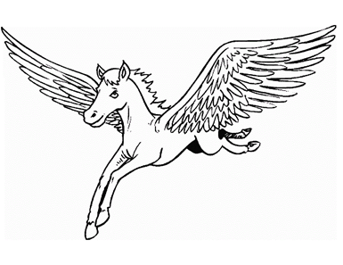
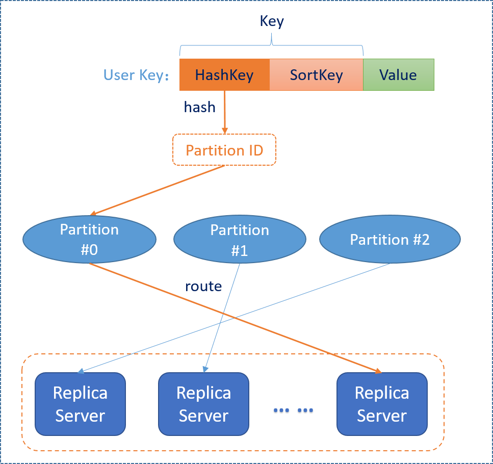

[**中文Wiki**](https://github.com/xiaomi/pegasus/wiki), [**微信交流群**](https://github.com/XiaoMi/pegasus/wiki/%E5%85%B3%E4%BA%8E%E6%88%91%E4%BB%AC), [**slack channel**](https://join.slack.com/t/pegasus-kv/shared_invite/enQtMjcyMjQzOTk4Njk1LWVkMjlkMGE5Mzg1Y2M3MDc0NGYyYzQ5YzYyMGE0ZjlhMDMyNjU1ZGViYzdjZmUwNjVmNGE0ZDdkMWJiN2Q1MDY)

## What is Pegasus?

Pegasus is a distributed key-value storage system developed and maintained by Xiaomi Cloud Storage Team, with targets of
high availability, high performance, strong consistency and ease of use. The original motivation of this project is to replace
[Apache HBase](https://hbase.apache.org/) for users who only need simple key-value schema but require low latency and high availability.
It is based on the modified [rDSN](https://github.com/XiaoMi/rdsn)(original [Microsoft/rDSN](https://github.com/Microsoft/rDSN)) framework,
and uses modified [RocksDB](https://github.com/xiaomi/pegasus-rocksdb)(original [facebook/RocksDB](https://github.com/facebook/rocksdb)) as underlying storage engine.
The consensus algorithm it uses is [PacificA](https://www.microsoft.com/en-us/research/publication/pacifica-replication-in-log-based-distributed-storage-systems/).

## Features

* High performance

  Here are several key aspects that make Pegasus a high performance storage system: 
     - Implemented in C++
     - [Staged event-driven architecture](https://en.wikipedia.org/wiki/Staged_event-driven_architecture), a distinguished architecture that Nginx adopts.
     - High performance storage-engine with [RocksDB](https://github.com/facebook/rocksdb), though slight change is made to support fast learning.

* High availability

  Unlike Bigtable/HBase, a non-layered replication architecture is adopted in Pegasus in which an external DFS like GFS/HDFS isn't the dependency of the persistent data, which benefits the availability a lot. Meanwhile, availability problems in HBase which result from Java GC are totally eliminated for the use of C++.

* Strong consistency

  We adopt the [PacificA](https://www.microsoft.com/en-us/research/publication/pacifica-replication-in-log-based-distributed-storage-systems/#) consensus algorithm to make Pegasus a strong consistency system.

* Easily scaling out

  Load can be balanced dynamically to newly added data nodes with a global load balancer.

* Easy to use

  We provided C++ and Java client with simple interfaces to make it easy to use.

## Architecture overview

The following diagram shows the architecture of Pegasus:

Here is a brief explanation on the concepts and terms in the diagram:

* MetaServer: a component in Pegasus to do the whole cluster management. The meta-server is something like "HMaster" in HBase.
* Zookeeper: the external dependency of Pegasus. We use zookeeper to store the meta state of the cluster and do meta-server's fault tolerance.
* ReplicaServer: a component in Pegasus to serve client's read/write request. The replica-server is also the container for replicas.
* Partition/replica: the whole key space is split into several partitions, and each partition has several replicas for fault tolerance. You may want to refer to the [PacificA](https://www.microsoft.com/en-us/research/publication/pacifica-replication-in-log-based-distributed-storage-systems/#) algorithm for more details.

For more details about design and implementation, please refer to PPTs under [`docs/ppt/`](docs/ppt/).

## Data model & API overview

The data model in Pegasus is (hashkey + sortkey) -> value, in which:
* Hashkey is used for partitioning. Values with different hash keys may stored in different partitions.
* Sortkey is used for sorting within a hashkey. Values with the **same** hashkey but **different** sortkeys are in the **same partition**, and ordered by the sort key. If you use scan API to scan a single hashkey, you will get the values by the lexicographical order of sortkeys.

The following diagram shows the data model of Pegasus:

## Quick Start

You may want to refer to the [installation guide](docs/installation.md).

## Related Projects

Submodules:
* [rDSN](https://github.com/xiaomi/rdsn)
* [RocksDB](https://github.com/xiaomi/pegasus-rocksdb)

Client libs:
* [Java client](https://github.com/xiaomi/pegasus-java-client)
* [Python Client](https://github.com/xiaomi/pegasus-python-client)
* [Go Client](https://github.com/xiaomi/pegasus-go-client)
* [Node.js Client](https://github.com/xiaomi/pegasus-nodejs-client)
* [Scala Client](https://github.com/xiaomi/pegasus-scala-client)

Test tools:
* [Java YCSB](https://github.com/xiaomi/pegasus-YCSB)
* [Go YCSB](https://github.com/xiaomi/pegasus-YCSB-go)

Data import/export tools:
* [DataX](https://github.com/xiaomi/pegasus-datax)

## How to contribute

We open sourced this project because we know that it is far from mature and needs lots of
improvement. So we are looking forward to your [contribution](docs/contribution.md).

If you have more questions, please join our [slack channel](https://join.slack.com/t/pegasus-kv/shared_invite/enQtMjcyMjQzOTk4Njk1LWVkMjlkMGE5Mzg1Y2M3MDc0NGYyYzQ5YzYyMGE0ZjlhMDMyNjU1ZGViYzdjZmUwNjVmNGE0ZDdkMWJiN2Q1MDY).

## License

Copyright 2015-2018 Xiaomi, Inc. Licensed under the Apache License, Version 2.0:
http://www.apache.org/licenses/LICENSE-2.0

